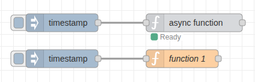

# node-red-contrib-async-function

Run heavy computations in Node-RED without slowing down your flows. This node works like the function node you already know, but keeps things responsive when the work gets heavy.



## What You Get

- Write JavaScript code that feels familiar—same as the function node.
- Run CPU-intensive tasks without blocking other flows.
- See real-time stats showing active workers and queue depth.
- Configure worker pools to match your workload.
- Handle bursts of messages smoothly with automatic queuing.
- Add external npm modules with auto-installation support.

## Before You Start

- Node.js 18 or newer (worker threads need it).
- Node-RED 2.0 or newer.

## How It Works

Drop a **worker function** node into your flow. Write your code just like you would in a regular function node. The difference? Your code runs in a separate worker thread by default (or a child process if configured), so heavy operations won't freeze Node-RED.

## When to Use This

**Great For:**
- Calculating prime numbers, running crypto operations, or processing large datasets.
- Tasks that take more than 10 milliseconds to finish.
- Keeping your dashboard and other flows responsive during heavy work.

**Skip It For:**
- Simple math or quick transformations (the regular function node is faster).
- Flows that require live context reads/writes during execution (context is snapshot-based).

## Node Options

### Code & Behavior
- **Name** – Optional label for your canvas.
- **Function** – Your JavaScript code. Works with `async/await`, `return`, and `require()`.
- **Outputs** – How many output wires (0-10). Return an array for multiple outputs.
- **Timeout** – Maximum seconds to wait before killing the worker. Default: 30 seconds.
- **Runtime** – Worker Threads (default, fastest) or Child Process (for native modules like `gl`).

### Worker Pool
- **Workers** – Fixed number of workers (1-16). Each node maintains exactly this many workers. Default: 3.
- **Queue Size** – Messages to queue when all workers are occupied. Default: 100.

### Modules
Add external npm modules that will be available in your code. Similar to the standard Node-RED function node's module feature.

- **Module** – The npm package name (e.g., `lodash`, `moment`, `@scope/package`).
- **Import as** – Variable name to access the module in your code.

Modules are auto-installed to `~/.node-red` on first deploy if not already available. Use them directly in your code without `require()`:

```javascript
// With modules: lodash → _, moment → moment
const doubled = _.map(msg.payload, x => x * 2);
msg.timestamp = moment().format('YYYY-MM-DD');
return msg;
```

### Buffer Handling
- **Buffers** – Worker Threads use zero-copy transfer when possible. Child Process mode and non-transferable buffers fall back to shared memory (`/dev/shm` on Linux, otherwise `os.tmpdir()`), with base64 fallback if needed.

## Typical Flow

1. Add a **worker function** node to your workspace.
2. Connect an Inject node (input) and a Debug node (output).
3. Write a simple script:
   ```javascript
   msg.payload = msg.payload * 2;
   return msg;
   ```
4. Deploy and trigger. Watch the status update in real time.

## What You Can Use in Your Code

**Available:**
- `msg` – The message object (must be serializable)
- `return` – Return a single message or array of messages
- `async/await` – For asynchronous operations
- `require()` – Load Node.js built-in or installed modules
- Configured modules – Available directly as variables (no require needed)
- `console` – Logging functions
- `setTimeout`, `setInterval` – Timers

**Notes:**
- `context`, `flow`, `global` are snapshot-based: reads are from the snapshot, writes are applied after the function completes
- Snapshot includes only literal keys found in `flow.get("key")` / `global.get("key")` / `context.get("key")`
- Context store selection is not supported (default store only)
- `node.warn/error/log` are collected and forwarded to the main thread
- Non-serializable objects (functions, symbols, etc.)

## Code Examples

### Simple Transformation
```javascript
msg.payload = msg.payload * 2;
return msg;
```

### Using External Modules

**Option 1: Configure in Setup tab (recommended)**

Add the module in the Modules section of the Setup tab, then use it directly:
```javascript
// Module configured: lodash → _
msg.payload = _.sortBy(msg.payload, 'name');
return msg;
```

**Option 2: Traditional require()**
```javascript
const crypto = require('crypto');

msg.hash = crypto.createHash('sha256')
    .update(msg.payload)
    .digest('hex');

return msg;
```

### CPU-Intensive Task (Won't Block!)
```javascript
function isPrime(n) {
    if (n <= 1) return false;
    for (let i = 2; i * i <= n; i++) {
        if (n % i === 0) return false;
    }
    return true;
}

const limit = msg.payload;
const primes = [];

for (let i = 2; i <= limit; i++) {
    if (isPrime(i)) {
        primes.push(i);
    }
}

msg.payload = primes;
return msg;
```

### Multiple Outputs
```javascript
if (msg.payload > 100) {
    return [msg, null];  // Send to first output
} else {
    return [null, msg];  // Send to second output
}
```

## Status Display

The node shows you what's happening in real time:

- **Active: 2/4** – 2 workers processing out of 4 total
- **Queue: 5** – 5 messages waiting
- **Green dot** – Normal operation
- **Yellow dot** – Queue filling up (>50 messages)
- **Red dot** – Queue almost full (>90%) or error
- **Ring** – All workers busy with a backlog

## Performance Notes

- Worker threads add about 5-10ms overhead per message (child process mode is higher).
- Best for operations taking more than 10ms to run.
- Each node maintains a fixed pool of workers—no startup delay or dynamic scaling overhead.
- Workers are dedicated per-node, ensuring predictable performance.
- **Binary Fast Path**: Worker threads use zero-copy transfer when possible; shared memory is the fallback.
- Event loop never blocks, even when processing multi-MB binary data (images, files, etc.).

## Error Handling

Errors in your code get caught and sent to a Catch node:

```javascript
if (!msg.payload) {
    throw new Error('Payload is required');
}
```

## Installation

```bash
cd ~/.node-red
npm install @rosepetal/node-red-contrib-async-function
```

Restart Node-RED and find the node in the **function** category.

## Migration

### From minWorkers/maxWorkers

If you're upgrading from a version that used `minWorkers` and `maxWorkers`:
- Your existing flows will automatically migrate to use the new `numWorkers` parameter
- The migration uses your previous `maxWorkers` value as the fixed worker count
- Check the Node-RED log for migration messages
- Edit your nodes to see the new simplified "Workers" configuration field
- **Note**: The new version uses a fixed worker pool instead of dynamic scaling for more predictable performance

## Contributing

Found a bug or have an idea? Open an issue or pull request on [GitHub](https://github.com/rosepetal-ai/node-red-contrib-async-function).

## License

Apache-2.0 © 2025 Rosepetal

---

**Built by [Rosepetal](https://www.rosepetal.ai)** – Making Node-RED flows faster and friendlier.
